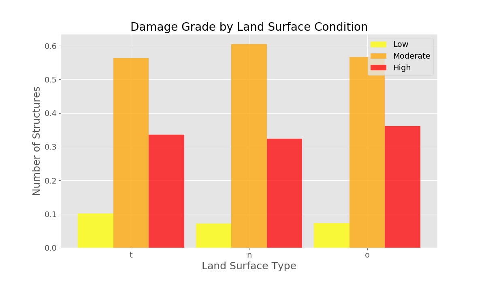
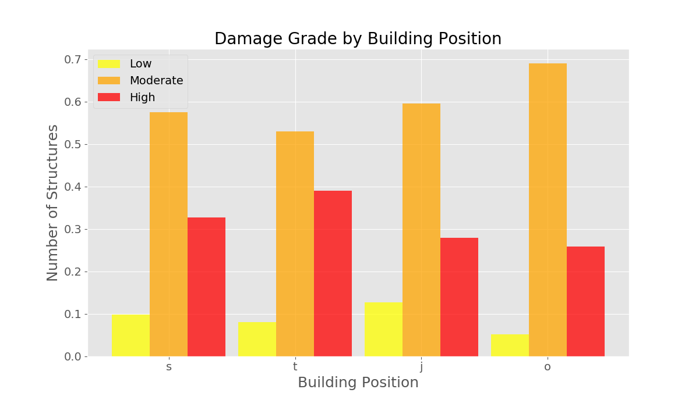
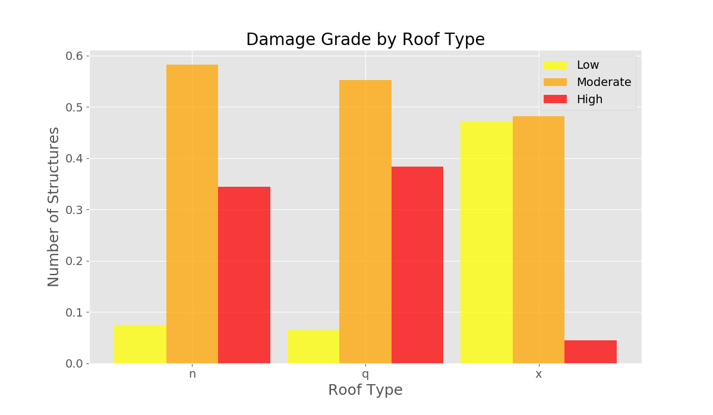
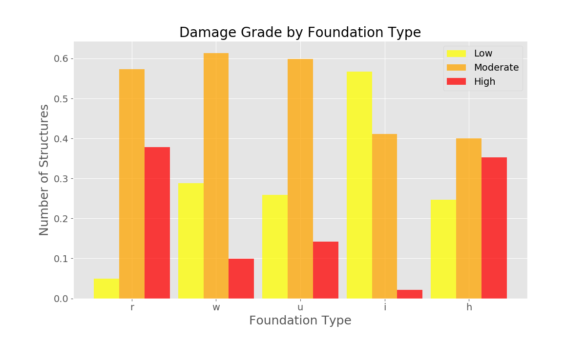
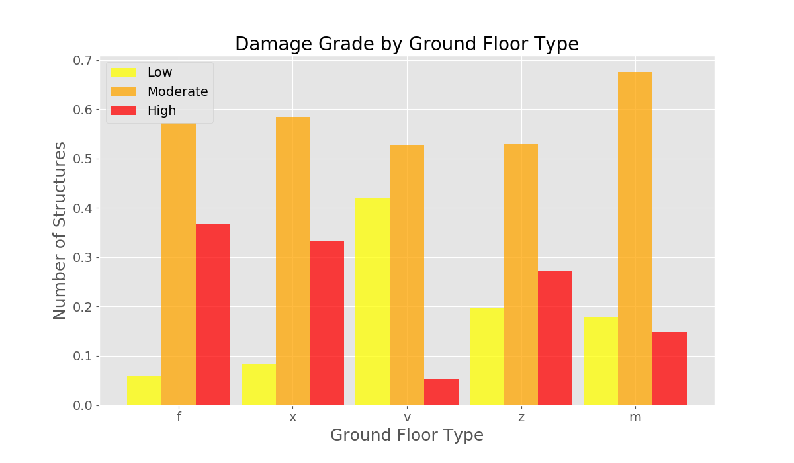
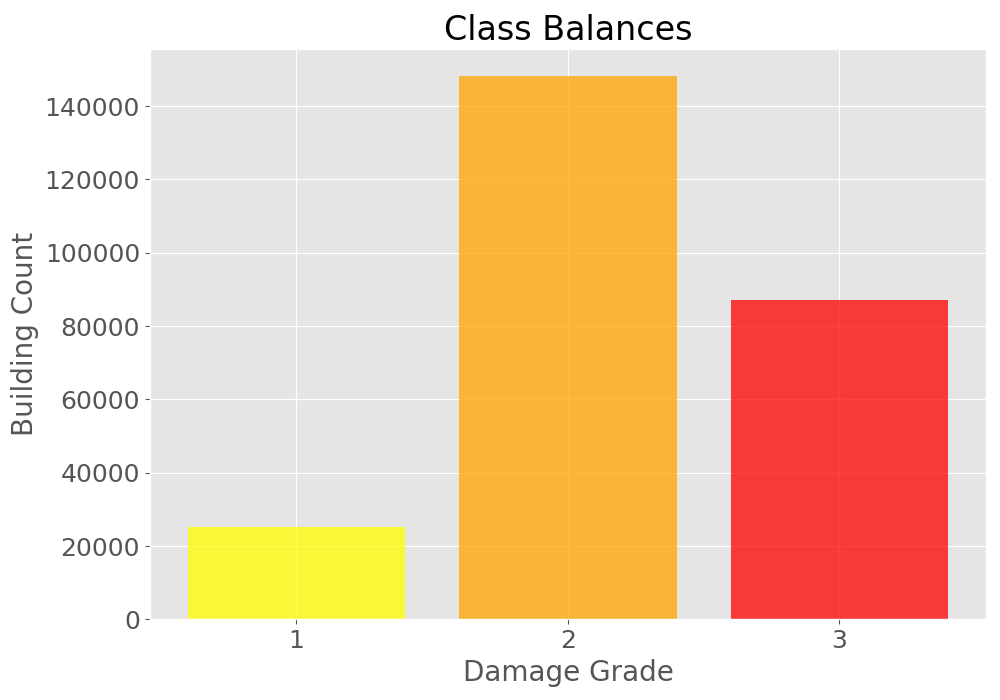

# Earthquake Predictor
## Annie Rumbles
[DrivenData competition](https://www.drivendata.org/competitions/57/nepal-earthquake/page/134/): ***"Based on aspects of building location and construction, your goal is to predict the level of damage to buildings caused by the 2015 Gorkha earthquake in Nepal."***

### Table of Contents
- [The Data](##the-data)
- [EDA](##exploratory-data-analysis)
- [Principal Component Analysis](###principal-component-analysis)
- [Modelling](##modelling)
- [Results](##results)
- [Analysis](##analysis)
- [Next Steps](##next-steps)
- [Citations](##citations)
 
## The Data
The data was collected through surveys by Kathmandu Living Labs and the Central Bureau of Statistics, which works under the National Planning Commission Secretariat of Nepal. This survey is one of the largest post-disaster datasets ever collected, containing valuable information on earthquake impacts, household conditions, and socio-economic-demographic statistics1.

## Exploratory Data Analysis

To get an idea of the data, I combined the training labels to the training set to see if there were any obvious factors that could predict damage grade.

The above plot represents the damage count for different structure types. As you can see, `rc_engineered`, `rc_non_engineered` and `cement_mortar_brick` had the lowest instances of a damage grade of 3, while `adobe_mud`, `mud_mortar_stone`, `stone_flag` had the most frequent occurrence of a damage grade of 3. 

I also wanted to look into the features with a coded type, like `land_surface_condition`, `roof_type`, `foundation_type`, `ground_floor_type`, and `building_position` to see if they would give any indication to the damage. I found that `land_surface_condition` and `building_position` didn't give much away as you can see below:

However,  `roof_type`, `foundation_type` and `ground_floor_type` did seem to have some indicators for damage grade.

In the training set, the classes were fairly imbalanced. A damage level of 2 (which I label as `moderate` intermittently) accounted for approximately 57% of the training set, while a damage level of 3 (`high`) was approximately 33%, and finally, a damage grade of 1 (`low`) accounted for about 10% of the training set. To visualize the imbalance, see the plot below:

<!--  -->

## Modelling

### Principal Component Analysis

### Random Forest

For my initial model, I decided to try a random forest right out of the box, with 200 estimators using these features, in the hopes that a simple model with only a few features may prove to be more applicable to unseen data: `count_floors_pre_eq`, `age`, `area_percentage`, `height_percentage`. I have consolidated all F1-micro scores in the table in the [results](##results) section below.

## Results

|  Model  |  Micro Averaged F1-Score  |
|---------|---------------------------|
|   RF    |            .44            |

## Analysis

## Next Steps

## Citations
1[Richter's Predictor: Modeling Earthquake Damage](https://www.drivendata.org/competitions/57/nepal-earthquake/page/134/)
