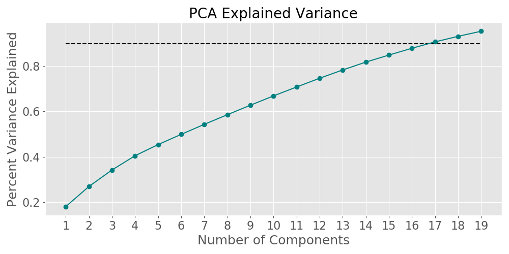
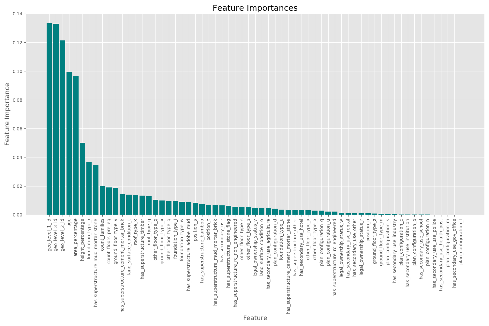

# Earthquake Predictor
## Annie Rumbles
[DrivenData competition](https://www.drivendata.org/competitions/57/nepal-earthquake/page/134/): ***"Based on aspects of building location and construction, your goal is to predict the level of damage to buildings caused by the 2015 Gorkha earthquake in Nepal."***

### Table of Contents
- [The Data](##the-data)
- [EDA](##exploratory-data-analysis)
- [Principal Component Analysis](###principal-component-analysis)
- [Modelling](##modelling)
- [Results](##results)
- [Analysis](##analysis)
- [Next Steps](##next-steps)
- [Citations](##citations)
 
## The Data
The data was collected through surveys by Kathmandu Living Labs and the Central Bureau of Statistics, which works under the National Planning Commission Secretariat of Nepal. This survey is one of the largest post-disaster datasets ever collected, containing valuable information on earthquake impacts, household conditions, and socio-economic-demographic statistics1.

## Exploratory Data Analysis

To get an idea of the data, I combined the training labels to the training set to see if there were any obvious factors that could predict damage grade.

The above plot represents the damage count for different structure types. As you can see, `rc_engineered`, `rc_non_engineered` and `cement_mortar_brick` had the lowest instances of a damage grade of 3, while `adobe_mud`, `mud_mortar_stone`, `stone_flag` had the most frequent occurrence of a damage grade of 3. 

I also wanted to look into the features with a coded type, like `land_surface_condition`, `roof_type`, `foundation_type`, `ground_floor_type`, and `building_position` to see if they would give any indication to the damage. I found that `land_surface_condition` and `building_position` didn't give much away as you can see below:

However, `roof_type`, `foundation_type` and `ground_floor_type` did seem to have some indicators for damage grade.

In the training set, the classes were fairly imbalanced. A damage level of 2 (which I label as `moderate`) accounted for approximately 57% of the training set, while a damage level of 3 (`high`) was approximately 33%, and finally, a damage grade of 1 (`low`) accounted for about 10% of the training set. To visualize the imbalance, see the plot below:

## Modelling

### Principal Component Analysis

While it would take 17 components to account for 90% of the variance in the data:

I still decided to plot 3 components in 3 dimensions to see if there could be any dilineation.

### Random Forest

For my initial model, I decided to try a random forest right out of the box with 500 estimators and getting dummies for the features that were object types. While the `geo_level` features are coded as integers, I decided to keep them as numbers instead of dummying them to see how the random forest would perform. I have consolidated all F1-micro scores in the table in the [results](##results) section below.

## Results

|        Model       |  Micro Averaged F1-Score  |
|--------------------|---------------------------|
|Logistic Regression |            .30            | 
|   Random Forest    |            .71            |
|   Gradient Boost   |            .60            |

## Analysis

There are many permutations and subsets of features that would impact model performance. I could work on modeling this dataset for a long time. After my initial modeling, using all features, the random forest performed best. Below are the feature importances for that model.

## Next Steps

There are endless ways to go about engineering features and subsetting, and that is something I am going to be playing around with.

## Citations
1[Richter's Predictor: Modeling Earthquake Damage](https://www.drivendata.org/competitions/57/nepal-earthquake/page/134/)
