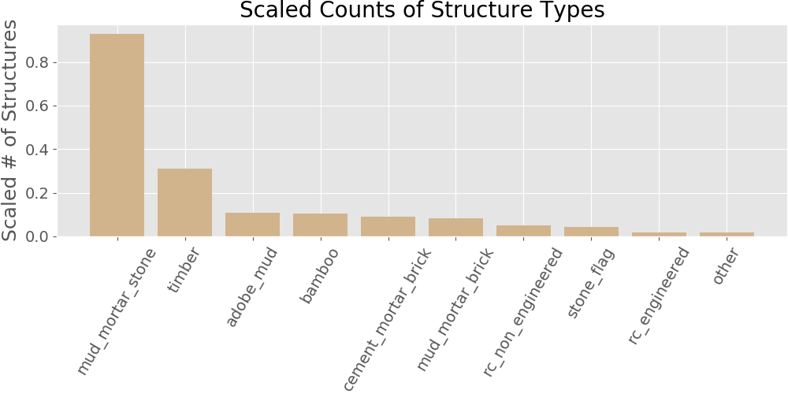

# Earthquake Predictor
## Annie Rumbles
[DrivenData competition](https://www.drivendata.org/competitions/57/nepal-earthquake/page/134/): ***"Based on aspects of building location and construction, your goal is to predict the level of damage to buildings caused by the 2015 Gorkha earthquake in Nepal."***

### Table of Contents
- [The Data](##the-data)
- [EDA](##exploratory-data-analysis)
- [Featurization](##featurization)
- [Modelling](##modelling)
- [Results](##results)
- [Analysis](##analysis)
- [Next Steps](##next-steps)
- [Citations](##citations)
 
## The Data
The data was collected through surveys by Kathmandu Living Labs and the Central Bureau of Statistics, which works under the National Planning Commission Secretariat of Nepal. This survey is one of the largest post-disaster datasets ever collected, containing valuable information on earthquake impacts, household conditions, and socio-economic-demographic statistics1.

## Exploratory Data Analysis

## Featurization

## Modelling

## Results

## Analysis

## Next Steps

## Citations
1[Richter's Predictor: Modeling Earthquake Damage](https://www.drivendata.org/competitions/57/nepal-earthquake/page/134/)
